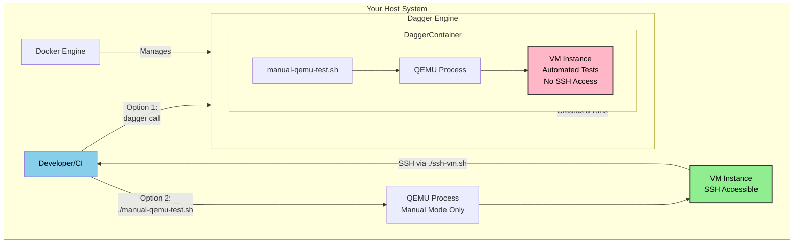

# Cluster-Bloom CI with Dagger

This directory contains the Dagger module for Cluster-Bloom's CI/CD automation. Dagger provides a portable, programmable CI/CD engine that works locally and in any CI environment (GitHub Actions, Gitea Actions, GitLab CI, etc.).

## Table of Contents

- [Features](#features)
- [Prerequisites](#prerequisites)
- [QEMU Setup](#qemu-setup)
  - [Linux](#linux)
  - [macOS](#macos)
  - [Windows](#windows)
  - [Verify Installation](#verify-installation)
- [Quick Start](#quick-start)
  - [Manual VM Access for Validation](#manual-vm-access-for-validation)
- [Available Dagger Functions](#available-dagger-functions)
- [Running in CI](#running-in-ci)
  - [GitHub Actions](#github-actions)
  - [Gitea Actions](#gitea-actions)
- [Cross-Platform QEMU Acceleration](#cross-platform-qemu-acceleration)
- [Architecture](#architecture)
- [VM Profiles](#vm-profiles)
- [Performance Expectations](#performance-expectations)
- [Troubleshooting](#troubleshooting)
- [Best Practices](#best-practices)
- [Resources](#resources)

## Features

- **Cross-platform QEMU testing** - Automatically detects and uses hardware acceleration:
  - Linux: KVM (`-accel=kvm`)
  - macOS: Hypervisor.framework (`-accel=hvf`)
  - Windows: Windows Hypervisor Platform (`-accel=whpx`)
- **Containerized builds** - Reproducible builds using Go containers
- **Unit testing** - Run Go tests in isolated containers
- **QEMU VM validation** - Test full Bloom installation in isolated VMs
- **Artifact export** - Export built binaries to local filesystem

## Prerequisites

### Local Development
- [Dagger CLI](https://docs.dagger.io/install) installed
- Docker or compatible container runtime
- Go 1.24+ (for local development)
- QEMU (required for VM validation tests - see setup instructions below)

### CI Environment (GitHub/Gitea Actions)
- Runner with container support
- QEMU installed on runners
- KVM access for Linux runners (optional, improves QEMU performance)
- Nested virtualization enabled (for full VM tests)

## QEMU Setup

QEMU is required to run VM validation tests. Install it for your platform:

### Linux

**Note for WSL (Windows Subsystem for Linux) users**: Follow the Linux instructions below for your WSL distribution (Ubuntu, Debian, etc.). QEMU will run in WSL, and you can SSH into VMs using the same commands as native Linux.

#### Ubuntu/Debian
```bash
sudo apt-get update
sudo apt-get install -y qemu-system-x86 qemu-utils
```

#### Fedora/RHEL/CentOS
```bash
sudo dnf install -y qemu-system-x86 qemu-img
```

#### Arch Linux
```bash
sudo pacman -S qemu-full
```

#### Enable KVM (Recommended for performance)
```bash
# Check if KVM is available
lsmod | grep kvm

# If not loaded, enable it
sudo modprobe kvm
sudo modprobe kvm_intel  # For Intel CPUs
# OR
sudo modprobe kvm_amd    # For AMD CPUs

# Add your user to the kvm group for /dev/kvm access
sudo usermod -aG kvm $USER
# Log out and back in for group changes to take effect
```

### macOS

#### Using Homebrew
```bash
brew install qemu
```

**Note**: Hardware acceleration via Hypervisor.framework is automatic on macOS 10.10+. No additional configuration needed.

### Windows

#### Using Chocolatey
```powershell
choco install qemu
```

#### Using Scoop
```powershell
scoop install qemu
```

#### Manual Installation
1. Download QEMU from [qemu.org](https://www.qemu.org/download/#windows)
2. Run the installer
3. Add QEMU to your PATH: `C:\Program Files\qemu`

#### Enable Windows Hypervisor Platform (Optional, for acceleration)
```powershell
# Run as Administrator
Enable-WindowsOptionalFeature -Online -FeatureName HypervisorPlatform
# Restart required
```

### Verify Installation

After installation, verify QEMU is available:

```bash
qemu-system-x86_64 --version
```

You should see output like:
```
QEMU emulator version 8.x.x
```

## Quick Start

### 1. Initialize the Dagger Module

The Dagger module needs to generate its SDK code before first use:

```bash
cd ci
dagger develop
```

This creates the `internal/dagger` package with generated code.

### 2. Run Locally

#### Build the bloom binary
```bash
dagger -m ci call build --source=. export --path=dist/bloom
```

#### Run unit tests
```bash
dagger -m ci call test --source=.
```

#### Run QEMU validation
```bash
dagger -m ci call validate-in-qemu --source=.
```

#### Run QEMU validation with custom profile
```bash
dagger -m ci call validate-in-qemu --source=. \
  --profile=tests/qemu/profile_8_nvme.yaml \
  --config=tests/qemu/bloom.yaml
```

#### Manual VM Access for Validation

To SSH into a VM for manual verification, you must run the QEMU test script **directly on your host** (not through Dagger):

```bash
# First, build the bloom binary
dagger -m ci call build --source=. export --path=dist/bloom

# Run the manual QEMU test script directly (NOT via Dagger)
./tests/qemu/manual-qemu-test.sh qemu-test-vm ./tests/qemu/profile_2_nvme.yaml ./dist/bloom ./tests/qemu/bloom.yaml

# SSH into the running VM (from another terminal)
cd qemu-test-vm && ./ssh-vm.sh

# Stop the VM when done
cd qemu-test-vm && ./stop-vm.sh
```

**Why can't I SSH when using `dagger call`?**

When you run `dagger -m ci call validate-in-qemu`, Dagger creates an ephemeral Ubuntu container, runs QEMU inside that container, executes automated tests, and then destroys the container. The VM lives inside the container and is not accessible from your host system.

When you run `./tests/qemu/manual-qemu-test.sh` directly, QEMU runs on your host and creates the VM in a local directory (`qemu-test-vm/`), making it accessible via SSH. See the [Architecture](#architecture) section for a visual diagram.

#### Run full CI pipeline
```bash
# Skip QEMU (fast)
dagger -m ci call all --source=.

# Include QEMU validation
dagger -m ci call all --source=. --skip-qemu=false
```

## Available Dagger Functions

### `build(source *Directory) *File`
Builds the bloom binary from source.

**Parameters:**
- `source`: Source directory (required)

**Example:**
```bash
dagger -m ci call build --source=. export --path=dist/bloom
```

### `test(source *Directory) string`
Runs Go unit tests.

**Parameters:**
- `source`: Source directory (required)

**Example:**
```bash
dagger -m ci call test --source=.
```

### `validate-in-qemu(source *Directory, profile string, config string) string`
Runs the QEMU test script to validate bloom installation in a VM.

**Parameters:**
- `source`: Source directory (required)
- `profile`: VM configuration profile (default: `tests/qemu/profile_2_nvme.yaml`)
- `config`: Bloom configuration file (default: `tests/qemu/bloom.yaml`)

**Example:**
```bash
# Default profile
dagger -m ci call validate-in-qemu --source=.

# Custom profile and config
dagger -m ci call validate-in-qemu --source=. \
  --profile=tests/qemu/profile_8_nvme.yaml \
  --config=tests/qemu/bloom-custom.yaml
```

**Note:** QEMU automatically detects and uses hardware acceleration (KVM on Linux, HVF on macOS, WHPX on Windows).

### `all(source *Directory, skipQemu bool) string`
Runs the complete CI pipeline: build, test, and optionally QEMU validation.

**Parameters:**
- `source`: Source directory (required)
- `skipQemu`: Skip QEMU validation (default: `true`)

**Example:**
```bash
# Skip QEMU (fast)
dagger -m ci call all --source=.

# Include QEMU
dagger -m ci call all --source=. --skip-qemu=false
```

### `export-binary(source *Directory, outputPath string) string`
Builds and exports the bloom binary to a local directory.

**Parameters:**
- `source`: Source directory (required)
- `outputPath`: Output directory path (default: `../dist`)

**Example:**
```bash
dagger -m ci call export-binary --source=. --output-path=dist
```

## Running in CI

### GitHub Actions

The workflow is located at [`.github/workflows/dagger-ci.yml`](../.github/workflows/dagger-ci.yml).

#### Trigger Manually
1. Go to **Actions** tab in GitHub
2. Select **Dagger CI** workflow
3. Click **Run workflow**
4. Choose whether to enable QEMU tests

#### Automatic Triggers
- **On push to `main` or `develop`**: Runs fast tests + QEMU tests
- **On pull requests**: Runs fast tests only
- **Manual dispatch**: Optionally run QEMU tests

#### Example Commands
```bash
# Trigger via gh CLI
gh workflow run dagger-ci.yml

# Trigger with QEMU enabled
gh workflow run dagger-ci.yml -f enable_qemu=true
```

### Gitea Actions

The workflow is located at [`.gitea/workflows/dagger-ci.yml`](../.gitea/workflows/dagger-ci.yml).

Gitea Actions uses the same syntax as GitHub Actions, so the workflow is identical.

#### Key Differences from GitHub Actions
- Gitea Actions is self-hosted, so you control the runner environment
- You can ensure KVM is available on your runners for better QEMU performance
- Artifact retention and runner capabilities may differ based on your setup

#### Setup Requirements
1. Enable Gitea Actions on your instance
2. Configure runners with Docker support
3. (Optional) Enable KVM on runners for faster QEMU tests

### Differences Between GitHub and Gitea

| Feature | GitHub Actions | Gitea Actions |
|---------|---------------|---------------|
| Syntax | GitHub Actions YAML | Compatible with GitHub Actions |
| Runners | GitHub-hosted or self-hosted | Self-hosted only |
| KVM Support | Not available on hosted runners | Available on your runners |
| Artifact Storage | GitHub-managed | Self-managed |
| Trigger Methods | UI, API, gh CLI | UI, API |
| Workflow Files | `.github/workflows/` | `.gitea/workflows/` |

## Cross-Platform QEMU Acceleration

The QEMU test script (`tests/qemu/manual-qemu-test.sh`) automatically detects the host OS and enables appropriate acceleration:

### Linux
- **Acceleration**: KVM (`-accel=kvm`)
- **CPU**: `host` (passthrough)
- **Requirements**: `/dev/kvm` device access
- **Performance**: Near-native

### macOS
- **Acceleration**: Hypervisor.framework (`-accel=hvf`)
- **CPU**: `qemu64` (emulated)
- **Requirements**: macOS 10.10+ with Hypervisor.framework
- **Performance**: ~70-80% of native

### Windows
- **Acceleration**: Windows Hypervisor Platform (`-accel=whpx`)
- **CPU**: `qemu64` (emulated)
- **Requirements**: Windows 10+ with WHPX enabled
- **Performance**: ~60-70% of native

### No Acceleration (Fallback)
- **CPU**: `qemu64` (emulated)
- **Performance**: Very slow (~5-10% of native)

## Architecture

### Component Architecture



**Legend:**
- 🟢 **Green (HostVM)**: VM runs directly on your system - **SSH access available**
- 🔴 **Pink (ContainerVM)**: VM runs inside ephemeral Dagger container - **No SSH access** (container exits when test completes)

### Two Ways to Run QEMU Tests

#### Option 1: Via Dagger (Automated, No SSH)
```bash
dagger -m ci call validate-in-qemu --source=.
```

**What happens:**
1. Dagger creates an Ubuntu container
2. Container installs QEMU and dependencies
3. Container runs `manual-qemu-test.sh` inside itself
4. QEMU creates a VM inside the container
5. Tests run automatically
6. Container exits and VM is destroyed
7. **❌ Cannot SSH**: Container and VM are gone when test completes

#### Option 2: Manual QEMU Script (Interactive, SSH Available)
```bash
./tests/qemu/manual-qemu-test.sh qemu-test-vm ./tests/qemu/profile_2_nvme.yaml ./dist/bloom ./tests/qemu/bloom.yaml
```

**What happens:**
1. Script runs QEMU directly on your host system
2. VM is created in the `qemu-test-vm/` directory
3. VM keeps running after script completes
4. **✅ Can SSH**: VM is on your filesystem and accessible
5. Use `cd qemu-test-vm && ./ssh-vm.sh` to access
6. Use `cd qemu-test-vm && ./stop-vm.sh` to stop when done

### Directory Structure

```
ci/
├── main.go           # Dagger module implementation
├── go.mod            # Go module dependencies
├── dagger.json       # Dagger module configuration
├── README.md         # This file
└── internal/         # Generated Dagger SDK (created by 'dagger develop')
    └── dagger/

tests/qemu/
├── manual-qemu-test.sh       # QEMU test script with cross-platform acceleration
├── profile_2_nvme.yaml       # VM profile: 4 CPU, 10G RAM, 2 NVMe drives
├── bloom.yaml                # Bloom config for QEMU tests
└── README.md

.github/workflows/
└── dagger-ci.yml     # GitHub Actions workflow

.gitea/workflows/
└── dagger-ci.yml     # Gitea Actions workflow
```

## VM Profiles

VM profiles define the hardware configuration for QEMU tests:

### profile_2_nvme.yaml
- **CPUs**: 4
- **Memory**: 10G
- **Root Disk**: 60G
- **Additional Disks**: 2x NVMe (1M each)
- **Use Case**: Basic disk detection and setup validation

### Creating Custom Profiles

Create a new YAML file in `tests/qemu/`:

```yaml
cpus: 8
memory: 16G
root_disk_size: 100G
disks:
  - size: 10G
    type: nvme
    format: raw
  - size: 10G
    type: nvme
    format: raw
  - size: 5G
    type: virtio
    format: qcow2
```

Supported disk types: `nvme`, `virtio`, `scsi`, `ide`
Supported formats: `raw`, `qcow2`

## Performance Expectations

| Environment | Acceleration | Boot Time | Test Time |
|-------------|-------------|-----------|-----------|
| Linux + KVM | KVM | ~30s | ~2min |
| macOS + HVF | HVF | ~45s | ~3min |
| Windows + WHPX | WHPX | ~60s | ~4min |
| No Acceleration | None | ~5min | ~15min+ |

## Troubleshooting

### "local path 'ci' does not exist"
You're likely running Dagger from a symlinked directory. Dagger may not resolve symlinks correctly. Use the real filesystem path instead:

```bash
# Don't run from symlinked path like /home/user/mylink
# Instead, use the actual path
cd /actual/path/to/cluster-bloom
dagger -m ci call validate-in-qemu --source=.
```

### "could not import dagger/bloom-ci/internal/dagger"
Run `dagger develop` in the `ci/` directory to generate the SDK code.

### QEMU Tests Failing
- **Check KVM access**: On Linux, ensure `/dev/kvm` exists and is writable
- **Try without KVM**: Run `dagger call validate-in-qemu --enable-kvm=false`
- **Check logs**: QEMU creates `startup.log` in the VM directory

### Slow QEMU Performance
- **Linux**: Enable KVM with `--enable-kvm=true`
- **macOS**: Ensure Hypervisor.framework is available (automatic)
- **Windows**: Enable Windows Hypervisor Platform (WHPX) in Windows Features

### CI Runner Out of Disk Space
- The QEMU tests download Ubuntu cloud images (~700MB)
- VM disk images can grow to several GB
- Increase runner disk space or use cleanup actions

## Best Practices

1. **Local Development**: Use `dagger call` for fast iteration
2. **CI/CD**: Let workflows handle orchestration
3. **QEMU Tests**: Only run in CI on main branches or manually
4. **Artifacts**: Export binaries to `dist/` for distribution
5. **KVM**: Enable on Linux runners for 10x faster QEMU tests

## Resources

- [Dagger Documentation](https://docs.dagger.io)
- [QEMU Documentation](https://www.qemu.org/docs/master/)
- [GitHub Actions Documentation](https://docs.github.com/actions)
- [Gitea Actions Documentation](https://docs.gitea.com/usage/actions/overview)
- [KVM Setup Guide](https://linux-kvm.org/page/Getting_Started)
