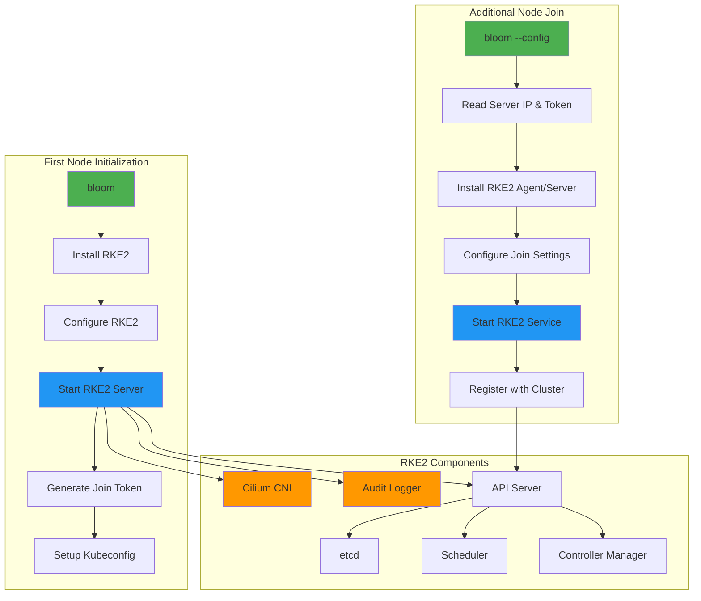

# Automated RKE2 Kubernetes Deployment

## Overview

ClusterBloom automates the deployment of RKE2-based Kubernetes clusters with specialized configurations for AMD GPU workloads and distributed storage systems.

## Components

### First Node Setup
Initializes the primary cluster node with all necessary configurations:
- RKE2 server installation and configuration
- Cluster initialization with custom parameters
- Token generation for additional nodes
- Kubeconfig setup for cluster access

**Configuration Files**:
- `/etc/rancher/rke2/config.yaml`: Main RKE2 configuration
- `/etc/rancher/rke2/audit/policy.yaml`: Kubernetes audit policy
- `/var/lib/rancher/rke2/server/node-token`: Join token for additional nodes

**Key Features**:
- Write kubeconfig with mode 0644 for easy access
- Disable default ingress controller (applications provide their own)
- Configure TLS SANs for secure API access
- Set up node labels for Longhorn storage integration
- OIDC authentication provider integration

### OIDC Authentication Integration
Automated OIDC provider configuration for Kubernetes API server authentication:
- **Default Provider**: Auto-configured `https://kc.{DOMAIN}/realms/airm` with audience `k8s`
- **Multiple Providers**: Support for additional OIDC providers via `ADDITIONAL_OIDC_PROVIDERS`
- **Audience Configuration**: Configurable client IDs per provider
- **RKE2 Integration**: Automatic kube-apiserver configuration

**Default OIDC Configuration**:
```yaml
# Generated automatically when DOMAIN is set
kube-apiserver-arg:
  - "oidc-issuer-url=https://kc.example.com/realms/airm"
  - "oidc-client-id=k8s"
  - "oidc-username-claim=preferred_username"
  - "oidc-groups-claim=groups"
```

**Multiple OIDC Providers**:
```yaml
# When ADDITIONAL_OIDC_PROVIDERS is configured
kube-apiserver-arg:
  - "oidc-issuer-url=https://kc.example.com/realms/airm"
  - "oidc-client-id=k8s"
  - "oidc-issuer-url=https://auth.company.com/realms/main"
  - "oidc-client-id=kubernetes"
  - "oidc-username-claim=preferred_username"
  - "oidc-groups-claim=groups"
```

**Authentication Flow**:
1. User obtains JWT token from configured OIDC provider
2. kubectl sends token with API requests via `Authorization: Bearer <token>`
3. kube-apiserver validates token against configured OIDC providers
4. User permissions determined by Kubernetes RBAC rules

### Additional Node Joining
Automated process for adding worker nodes or additional control plane nodes:
- Automatic RKE2 agent/server installation
- Secure token-based authentication
- Network configuration synchronization
- Service enablement and startup

**Worker Node Configuration**:
```yaml
server: https://\<FIRST_NODE_IP\>:9345
token: <JOIN_TOKEN>
```

**Control Plane Node Configuration**:
```yaml
server: https://\<FIRST_NODE_IP\>:9345
token: <JOIN_TOKEN>
write-kubeconfig-mode: "0644"
tls-san:
  - <NODE_IP>
```

### Cilium CNI Integration
Pre-configured with Cilium for advanced networking capabilities:
- **Network Policy Enforcement**: Fine-grained network security
- **VXLAN Overlay**: Port 8472/UDP for pod-to-pod communication
- **Health Checks**: Port 4240/TCP for health monitoring
- **Service Load Balancing**: eBPF-based load balancing
- **Network Visibility**: Optional Hubble for observability

**Cilium Features Enabled**:
- Native routing mode or VXLAN overlay (configurable)
- Kubernetes network policy support
- Service mesh capabilities (optional)
- Cluster-wide network connectivity

### Audit Logging
Built-in audit policy configuration for compliance and security monitoring:
- Metadata-level logging for all API requests
- Audit log rotation and retention
- Compliance with security standards (CIS, PCI-DSS)
- Integration with external log aggregation systems

**Audit Policy Configuration**:
```yaml
apiVersion: audit.k8s.io/v1
kind: Policy
rules:
  - level: Metadata
```

**Audit Log Location**: `/var/lib/rancher/rke2/server/logs/audit.log`

## Architecture


