# Storage Management with Longhorn

## Overview

ClusterBloom automates the deployment and configuration of Longhorn distributed storage system, providing persistent block storage for Kubernetes workloads.

## Components

### Disk Detection
Automatically identifies and selects available NVMe drives:
- **Detection Method**: Scans for NVMe block devices via /sys/block/
- **Filtering**: Excludes boot disks, mounted partitions, and swap devices
- **Virtual Disk Filtering**: Excludes QEMU, VMware virtual disks
- **Size Validation**: Ensures sufficient disk space for storage workloads

**Detection Process**:
```bash
# List NVMe devices
lsblk -d -o NAME,TYPE,SIZE | grep nvme

# Check mount status
mount | grep nvme

# Verify not swap
swapon --show
```

### Interactive Disk Selection
TUI interface for manual disk selection:
- **Visual Interface**: Terminal-based UI showing available disks
- **Disk Information**: Displays size, model, serial number
- **Multi-selection**: Select multiple disks for Longhorn storage pool
- **Confirmation**: Warns about data loss before formatting

**Selection Features**:
- Color-coded disk status (available, mounted, system)
- Keyboard navigation for disk selection
- Real-time disk information updates
- Safe abort option

### Automated Mounting
Formats and mounts selected drives with persistence:
- **Filesystem**: ext4 filesystem format
- **Mount Points**: `/mnt/disk0`, `/mnt/disk1`, etc.
- **fstab Entries**: UUID-based mounting for reliability
- **Mount Options**: `defaults,nofail` for robustness

**Mounting Process**:
1. Wipe existing filesystem signatures
2. Format disk with ext4
3. Get disk UUID
4. Create mount point directory
5. Add fstab entry with UUID
6. Mount disk

**fstab Entry Format**:
```
UUID=<disk-uuid> /mnt/disk0 ext4 defaults,nofail 0 2
```

### Longhorn Integration
Configures Longhorn distributed storage system:
- **Version**: v1.8.0
- **Storage Class**: `mlstorage` (default)
- **Replica Count**: 3 (configurable)
- **Data Locality**: Configurable (disabled, best-effort, strict)

**Longhorn Features**:
- **Distributed Storage**: Replicated block storage across nodes
- **Snapshots**: Volume snapshots for backup and recovery
- **Backups**: S3/NFS backup support
- **CSI Driver**: Container Storage Interface compliance
- **Volume Encryption**: Optional volume encryption
- **Volume Cloning**: Clone volumes for testing

**Longhorn Configuration**:
```yaml
apiVersion: v1
kind: ConfigMap
metadata:
  name: longhorn-default-setting
  namespace: longhorn-system
data:
  create-default-disk-labeled-nodes: "true"
  default-data-path: "/mnt/disk0"
  replica-soft-anti-affinity: "true"
  disable-revision-counter: "true"
  priority-class: "longhorn-critical"
```

### Storage Class Configuration
Default storage class for PVC provisioning:
```yaml
apiVersion: storage.k8s.io/v1
kind: StorageClass
metadata:
  name: mlstorage
  annotations:
    storageclass.kubernetes.io/is-default-class: "true"
provisioner: driver.longhorn.io
allowVolumeExpansion: true
reclaimPolicy: Delete
volumeBindingMode: Immediate
parameters:
  numberOfReplicas: "3"
  staleReplicaTimeout: "2880"
  fromBackup: ""
  fsType: "ext4"
```

## Architecture

```mermaid
flowchart TD
    %% Environment Variables
    subgraph Variables[" Environment Variables (Configuration) "]
        V1[NO_DISKS_FOR_CLUSTER: Skip all disk operations<br/>Default: false]
        V2[CLUSTER_DISKS: Pre-configured disk list<br/>e.g., '/dev/sdb,/dev/sdc'<br/>Default: empty]
        V3[CLUSTER_PREMOUNTED_DISKS: Override Longhorn config<br/>e.g., '/mnt/disk0,/mnt/disk1'<br/>Default: empty]
    end
    
    %% Legend
    subgraph Legend[" Legend "]
        L1[🟨 Variable Check Points - affect flow direction]
        L2[🟩 Start/End Points]
        L3[🟦 Configuration Write]
        L4[⬜ Process Steps]
    end
    
    Start([Start Disk Setup]) --> Variables
    Variables --> CheckSkip{NO_DISKS_FOR_CLUSTER?}
    
    CheckSkip -->|Yes = true| End([End - Skipped])
    CheckSkip -->|No = false| CheckSelected{CLUSTER_DISKS<br/>configured?}
    
    CheckSelected -->|Yes - has value| UseSelected[Use configured disks<br/>from CLUSTER_DISKS variable]
    CheckSelected -->|No - empty| GetUnmounted[GetUnmountedPhysicalDisks]
    
    GetUnmounted --> ListDisks[lsblk -dn -o NAME,TYPE]
    ListDisks --> FilterDisks{Filter disks}
    
    FilterDisks --> CheckDiskType{Disk type?}
    CheckDiskType -->|nvme*| AddToList1[Add to disk list]
    CheckDiskType -->|sd*| CheckVirtual{Is virtual disk?}
    CheckDiskType -->|Other| SkipDisk[Skip disk]
    
    CheckVirtual -->|Yes| SkipDisk
    CheckVirtual -->|No| AddToList2[Add to disk list]
    
    AddToList1 --> CheckMounted{Is mounted?}
    AddToList2 --> CheckMounted
    
    CheckMounted -->|Yes| SkipDisk
    CheckMounted -->|No| AddAvailable[Add to available disks]
    
    SkipDisk --> NextDisk{More disks?}
    AddAvailable --> NextDisk
    
    NextDisk -->|Yes| FilterDisks
    NextDisk -->|No| ShowSelection[Show disk selection UI]
    
    UseSelected --> MountDrives
    ShowSelection --> StoreSel[Store selected_disks<br/>in viper config]
    StoreSel --> MountDrives[MountDrives function]
    
    MountDrives --> CheckLonghorn{CLUSTER_PREMOUNTED_DISKS<br/>configured?}
    CheckLonghorn -->|Yes - has value| SkipMount[Skip mounting<br/>Use CLUSTER_PREMOUNTED_DISKS paths]
    CheckLonghorn -->|No - empty| ProcessEachDisk[Process each disk]
    
    ProcessEachDisk --> CheckFormat{Disk has ext4?}
    CheckFormat -->|Yes| CheckFstab{In /etc/fstab?}
    CheckFormat -->|No| WipePartitions[Wipe partitions if exist]
    
    WipePartitions --> FormatExt4[mkfs.ext4 -F -F]
    FormatExt4 --> CheckFstab
    
    CheckFstab -->|Yes| AutoMount[mount -a]
    CheckFstab -->|No| FindMountPoint[Find next available<br/>/mnt/diskX]
    
    AutoMount --> NextMountDisk{More disks?}
    FindMountPoint --> CreateDir[mkdir -p /mnt/diskX]
    CreateDir --> MountDisk[mount disk /mnt/diskX]
    MountDisk --> NextMountDisk
    
    NextMountDisk -->|Yes| ProcessEachDisk
    NextMountDisk -->|No| PersistMounts[PersistMountedDisks]
    
    PersistMounts --> GetUUID[Get UUID for each<br/>mounted disk]
    GetUUID --> UpdateFstab[Add to /etc/fstab:<br/>UUID=xxx /mnt/diskX ext4 defaults,nofail 0 2]
    UpdateFstab --> RemountAll[mount -a]
    
    RemountAll --> GenerateNodeLabels[GenerateNodeLabels]
    SkipMount --> GenerateNodeLabels
    
    GenerateNodeLabels --> CheckLonghornConfig{CLUSTER_PREMOUNTED_DISKS<br/>configured?}
    CheckLonghornConfig -->|Yes - has value| ParseConfig[Parse CLUSTER_PREMOUNTED_DISKS<br/>comma-separated list]
    CheckLonghornConfig -->|No - empty| FindMounted[Find mounted disks<br/>at /mnt/diskX]
    
    ParseConfig --> CreateLabelString[Join with 'xxx'<br/>delimiter]
    FindMounted --> UseAllMounted[Use all mounted disks]
    
    UseAllMounted --> CreateLabelString
    
    CreateLabelString --> WriteRKE2Config[Append to /etc/rancher/rke2/config.yaml:<br/>node-label:<br/>  - node.longhorn.io/create-default-disk=config<br/>  - node.longhorn.io/instance-manager=true<br/>  - silogen.ai/longhorndisks=disk0xxxdisk1xxx...]
    
    WriteRKE2Config --> End
    
    style Start fill:#32CD32,stroke:#006400,stroke-width:3px
    style End fill:#FF69B4,stroke:#C71585,stroke-width:3px
    style Variables fill:#D8BFD8,stroke:#8B008B,stroke-width:2px
    style CheckSkip fill:#FFD700,stroke:#FF4500,stroke-width:4px,color:#000000
    style CheckSelected fill:#FFD700,stroke:#FF4500,stroke-width:4px,color:#000000
    style CheckLonghorn fill:#FFD700,stroke:#FF4500,stroke-width:4px,color:#000000
    style CheckLonghornConfig fill:#FFD700,stroke:#FF4500,stroke-width:4px,color:#000000
    style WriteRKE2Config fill:#4682B4,stroke:#00008B,stroke-width:3px
```


