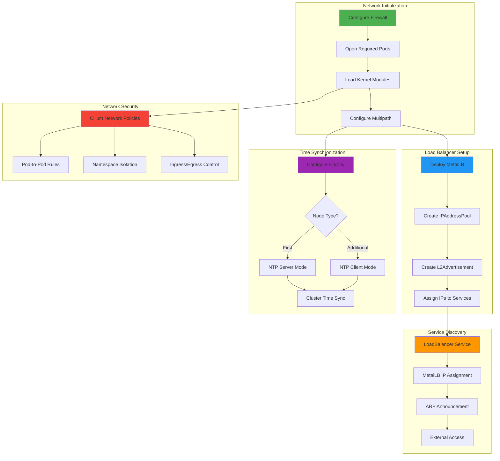

# Network Configuration

## Overview

ClusterBloom configures comprehensive networking infrastructure including load balancing, firewall rules, and storage multipath for reliable cluster operations.

## Components

### MetalLB Load Balancer
Automated MetalLB installation and configuration for bare-metal load balancing:
- **Version**: v0.14.9
- **Mode**: Layer 2 (ARP-based) or BGP
- **Namespace**: metallb-system
- **IP Pool**: Node IP address pool for service allocation

**MetalLB Features**:
- **Service Type LoadBalancer**: Native LoadBalancer service support
- **IP Address Management**: Automatic IP allocation from pools
- **Layer 2 Mode**: ARP-based IP advertisement
- **BGP Mode**: BGP peering for advanced routing (optional)
- **Multiple Pools**: Support for multiple IP address pools

**Deployment Process**:
1. Create metallb-system namespace
2. Deploy MetalLB CRDs and operators
3. Wait for MetalLB pods to be ready
4. Create IPAddressPool with node IP
5. Create L2Advertisement for IP announcement

### IP Address Pool Management
Dynamic IP pool configuration for services:
- **Pool Name**: `cluster-bloom-ip-pool`
- **Address Range**: Node IP as `/32` (single IP)
- **Expandable**: Can add additional IPs or ranges
- **Sharing**: Configurable pool sharing between services

**IPAddressPool Example**:
```yaml
apiVersion: metallb.io/v1beta1
kind: IPAddressPool
metadata:
  name: cluster-bloom-ip-pool
  namespace: metallb-system
spec:
  addresses:
  - 192.168.1.100/32
  autoAssign: true
```

**L2Advertisement Example**:
```yaml
apiVersion: metallb.io/v1beta1
kind: L2Advertisement
metadata:
  name: cluster-bloom-l2-adv
  namespace: metallb-system
spec:
  ipAddressPools:
  - cluster-bloom-ip-pool
  interfaces:
  - eth0
```

### Firewall Configuration
Opens required ports for cluster communication:

**RKE2 Control Plane Ports**:
- **6443/TCP**: Kubernetes API server
- **9345/TCP**: RKE2 supervisor API
- **10250/TCP**: Kubelet API
- **2379-2380/TCP**: etcd client and peer communication

**Cilium CNI Ports**:
- **8472/UDP**: VXLAN overlay network
- **4240/TCP**: Cilium health checks

**Additional Ports**:
- **30000-32767/TCP**: NodePort service range
- **80/TCP, 443/TCP**: HTTP/HTTPS ingress (optional)

**Firewall Configuration Commands**:
```bash
sudo ufw allow 6443/tcp
sudo ufw allow 9345/tcp
sudo ufw allow 10250/tcp
sudo ufw allow 2379:2380/tcp
sudo ufw allow 8472/udp
sudo ufw allow 4240/tcp
sudo ufw allow 30000:32767/tcp
```

### Multi-path Configuration
Sets up multipath for storage reliability:
- **Purpose**: Provides redundant paths to storage devices
- **Device Blacklisting**: Excludes system disks from multipath
- **Configuration**: `/etc/multipath.conf`
- **Service**: multipathd daemon

**Multipath Benefits**:
- Path failover for storage devices
- Load balancing across paths
- Automatic path recovery
- Enhanced storage reliability

**Multipath Configuration**:
```
blacklist {
    devnode "^(ram|raw|loop|fd|md|dm-|sr|scd|st)[0-9]*"
    devnode "^hd[a-z]"
    devnode "^sd[a-z]"
}
```

### Network Policy Support
Kubernetes network policy enforcement via Cilium:
- **Default Deny**: Optional default deny policies
- **Namespace Isolation**: Network isolation between namespaces
- **Ingress/Egress Rules**: Fine-grained traffic control
- **Pod-to-Pod**: Control pod-to-pod communication

**Example Network Policy**:
```yaml
apiVersion: networking.k8s.io/v1
kind: NetworkPolicy
metadata:
  name: allow-same-namespace
spec:
  podSelector: {}
  policyTypes:
  - Ingress
  ingress:
  - from:
    - podSelector: {}
```

### Time Synchronization
Chrony NTP configuration for cluster time sync:
- **Service**: chrony
- **Purpose**: Ensure consistent time across cluster nodes
- **Configuration**: `/etc/chrony/chrony.conf`
- **First Node**: Acts as NTP server for cluster
- **Additional Nodes**: Sync time from first node

**First Node Chrony Config**:
```
server 0.ubuntu.pool.ntp.org iburst
server 1.ubuntu.pool.ntp.org iburst
allow 0.0.0.0/0
local stratum 10
```

**Additional Node Chrony Config**:
```
server <FIRST_NODE_IP> iburst
```

## Architecture


