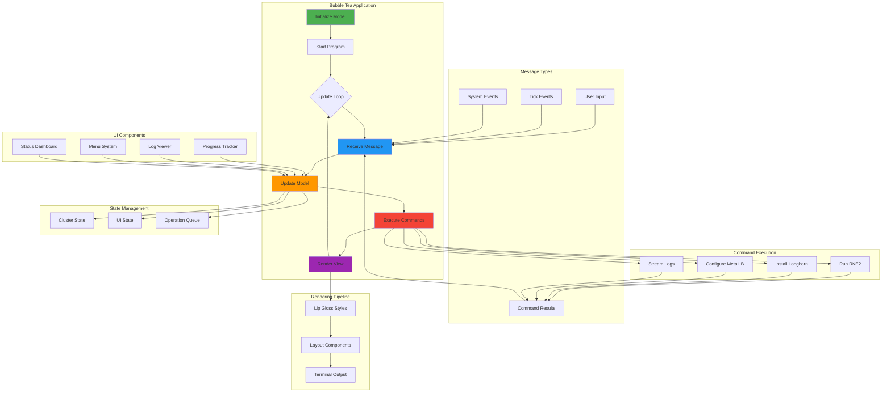

# Terminal UI Framework

## Overview

ClusterBloom provides an interactive terminal user interface (TUI) built with the Bubble Tea framework, offering real-time progress tracking, log streaming, and intuitive navigation throughout the cluster deployment process.

## Components

### Bubble Tea Framework
Modern TUI framework for Go applications:
- **Framework**: [Charm Bubble Tea](https://github.com/charmbracelet/bubbletea)
- **Architecture**: Elm-inspired model-view-update (MVU) pattern
- **Concurrency**: Safe concurrent updates via message passing
- **Rendering**: Efficient terminal rendering with Lip Gloss styling

**Bubble Tea MVU Pattern**:
1. **Model**: Application state structure
2. **Update**: State transitions based on messages
3. **View**: Render current state to terminal

**Key Features**:
- **Message-based Updates**: Type-safe state updates
- **Component Composition**: Reusable UI components
- **Tea Commands**: Asynchronous operations
- **Mouse Support**: Optional mouse interaction

### Progress Tracking
Visual progress indicators for long-running operations:
- **Spinner Components**: Animated spinners for active tasks
- **Progress Bars**: Percentage-based progress visualization
- **Status Messages**: Real-time operation status updates
- **Multi-stage Tracking**: Track multiple parallel operations

**Progress Components**:
- **Task List**: Hierarchical task display
- **Status Indicators**: ✓ (complete), ⊙ (in-progress), ✗ (error)
- **Time Estimates**: ETA for long operations
- **Nested Progress**: Sub-task progress tracking

**Example Progress Display**:
```
┌─ Cluster Setup ─────────────────────────────┐
│ ✓ System Dependencies Installed             │
│ ⊙ Installing RKE2...                    45% │
│   └─ Downloading binaries                   │
│ □ Configuring Network                       │
│ □ Setting up Storage                        │
└─────────────────────────────────────────────┘
```

### Log Streaming
Real-time log output with filtering and formatting:
- **Live Logs**: Stream logs from operations and containers
- **Log Levels**: Filter by DEBUG, INFO, WARN, ERROR
- **Color Coding**: Syntax highlighting for log messages
- **Auto-scroll**: Follow mode for continuous streaming
- **Searchable**: Quick search through log history

**Log Display Features**:
- **Timestamps**: Show/hide log timestamps
- **Source Labels**: Identify log source (RKE2, Longhorn, etc.)
- **Line Numbers**: Optional line numbering
- **Word Wrap**: Configurable word wrapping
- **Export**: Save logs to file

**Log Viewer Example**:
```
┌─ Logs (last 100 lines) ─────────────────────┐
│ [INFO]  2024-01-15 10:30:15  RKE2 started   │
│ [DEBUG] 2024-01-15 10:30:16  Loading config │
│ [WARN]  2024-01-15 10:30:20  Slow response  │
│ [ERROR] 2024-01-15 10:30:25  Connection err │
└───────────────────────────────────── [↓ F] ─┘
```

### Interactive Menus
Navigation and selection interfaces:
- **Menu Lists**: Scrollable option lists
- **Radio Buttons**: Single-selection options
- **Checkboxes**: Multi-selection options
- **Input Fields**: Text input with validation
- **Confirmation Dialogs**: Yes/No prompts

**Menu Features**:
- **Keyboard Navigation**: Arrow keys, vim bindings
- **Search**: Filter menu items by typing
- **Shortcuts**: Quick access keys (1-9)
- **Help Text**: Contextual help for each option

**Disk Selection Example**:
```
┌─ Select Disks for Longhorn ─────────────────┐
│                                              │
│ Select one or more disks (Space to toggle): │
│                                              │
│ [ ] /dev/sda  (500 GB)  System Disk         │
│ [✓] /dev/sdb  (1 TB)    Data Disk           │
│ [✓] /dev/sdc  (2 TB)    Data Disk           │
│ [ ] /dev/sdd  (500 GB)  Backup Disk         │
│                                              │
│ <Enter to confirm>  <Esc to cancel>         │
└──────────────────────────────────────────────┘
```

### Status Dashboard
Overview of cluster state and health:
- **Cluster Overview**: Node count, status, resources
- **Component Status**: RKE2, Longhorn, MetalLB health
- **Resource Metrics**: CPU, memory, disk usage
- **Recent Events**: Latest cluster events
- **Quick Actions**: Common operations

**Dashboard Layout**:
```
┌─ ClusterBloom Dashboard ────────────────────────────────────┐
│ Cluster: production-cluster          Status: ✓ Healthy      │
├──────────────────────────────────────────────────────────────┤
│ Nodes: 3/3 Ready                                             │
│   ├─ node-1  192.168.1.100  [Control Plane]  ✓              │
│   ├─ node-2  192.168.1.101  [Worker]         ✓              │
│   └─ node-3  192.168.1.102  [Worker]         ✓              │
├──────────────────────────────────────────────────────────────┤
│ Components:                                                  │
│   ├─ RKE2      v1.30.6      ✓ Running                        │
│   ├─ Longhorn  v1.7.2       ✓ Running                        │
│   └─ MetalLB   v0.14.9      ✓ Running                        │
├──────────────────────────────────────────────────────────────┤
│ Resources:                                                   │
│   ├─ CPU:     24/32 cores  (75%)  ████████░░░░░░            │
│   ├─ Memory:  48/64 GB     (75%)  ████████░░░░░░            │
│   └─ Storage: 1.2/3 TB     (40%)  ████░░░░░░░░░░            │
├──────────────────────────────────────────────────────────────┤
│ [A] Add Node  [R] Remove Node  [L] View Logs  [Q] Quit      │
└──────────────────────────────────────────────────────────────┘
```

### Error Handling
User-friendly error display and recovery:
- **Error Messages**: Clear, actionable error descriptions
- **Stack Traces**: Optional detailed error information
- **Retry Options**: Automatic or manual retry prompts
- **Rollback Support**: Option to revert failed operations
- **Help Links**: Context-specific documentation links

**Error Display Example**:
```
┌─ Error ──────────────────────────────────────┐
│ ✗ Failed to install RKE2                     │
│                                               │
│ Reason: Unable to download binary            │
│ Details: Connection timeout after 30s        │
│                                               │
│ Suggestions:                                  │
│  • Check network connectivity                │
│  • Verify firewall allows HTTPS              │
│  • Try again with different mirror           │
│                                               │
│ [R] Retry  [S] Skip  [A] Abort  [H] Help     │
└───────────────────────────────────────────────┘
```

### Styling and Themes
Consistent visual design with Lip Gloss:
- **Color Schemes**: Light/dark themes
- **Component Styles**: Borders, padding, alignment
- **Typography**: Bold, italic, underline
- **Icons**: Unicode symbols for status indicators

**Theme Support**:
- **Auto-detection**: Detect terminal color support
- **Fallback**: ASCII-only mode for limited terminals
- **Custom Themes**: User-defined color schemes

## Architecture



## Implementation Details

### Model Structure
```go
type Model struct {
    state        ClusterState
    progress     ProgressTracker
    logs         LogViewer
    menu         MenuComponent
    dashboard    Dashboard
    currentView  ViewType
    width        int
    height       int
}
```

### Update Function
```go
func (m Model) Update(msg tea.Msg) (tea.Model, tea.Cmd) {
    switch msg := msg.(type) {
    case tea.KeyMsg:
        return m.handleKeyPress(msg)
    case ProgressMsg:
        return m.updateProgress(msg)
    case LogMsg:
        return m.appendLog(msg)
    case ErrorMsg:
        return m.showError(msg)
    }
    return m, nil
}
```

### View Rendering
```go
func (m Model) View() string {
    switch m.currentView {
    case ViewDashboard:
        return m.dashboard.Render()
    case ViewLogs:
        return m.logs.Render()
    case ViewProgress:
        return m.progress.Render()
    default:
        return m.menu.Render()
    }
}
```
