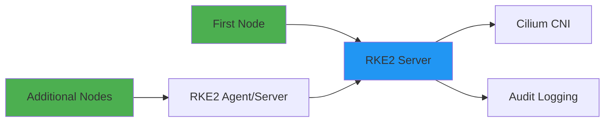
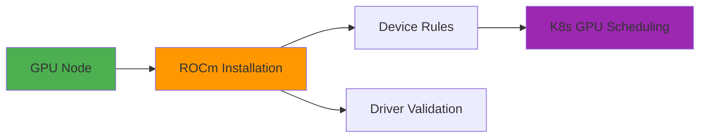
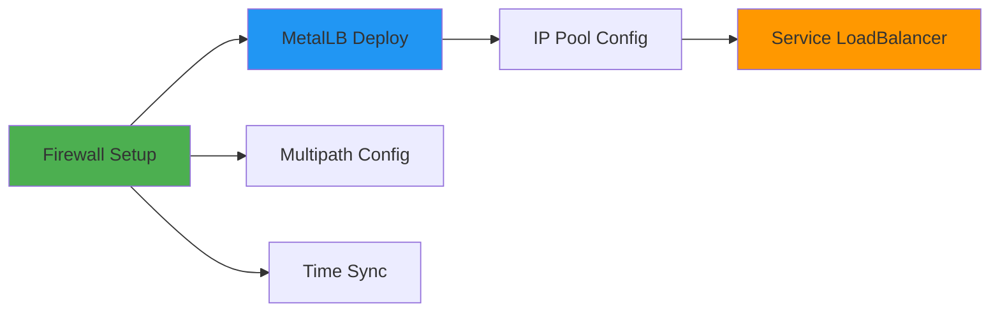
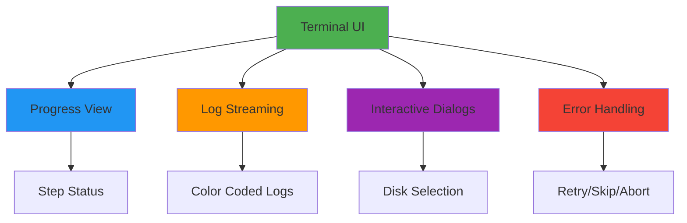

# Product Requirements Document: ClusterBloom

## Executive Summary

ClusterBloom is an automated Kubernetes cluster deployment and configuration tool specifically designed for AMD GPU environments. It streamlines the complex process of setting up production-ready Kubernetes clusters using RKE2, with specialized support for ROCm, Longhorn storage, and multi-node cluster configurations.

## Product Overview

### Purpose
ClusterBloom automates the deployment of Kubernetes clusters with AMD GPU support, eliminating the manual complexity of configuring ROCm, storage management, networking, and cluster joining procedures.

### Target Users
- DevOps Engineers managing AMD GPU workloads
- Platform Teams deploying Kubernetes infrastructure
- Organizations requiring automated cluster provisioning with AMD GPU support
- Teams needing reliable storage configuration with Longhorn

## Core Features

### 1. Automated RKE2 Kubernetes Deployment
Automated deployment of production-ready RKE2 clusters with first node initialization, additional node joining, Cilium CNI integration, and compliance-ready audit logging.



**[📄 Detailed Documentation](./01-rke2-deployment.md)**

### 2. AMD GPU Support with ROCm
Automated AMD GPU driver installation, device detection, permission configuration, and Kubernetes GPU resource integration for AI/ML workloads.



**[📄 Detailed Documentation](./02-rocm-support.md)**

### 3. Storage Management with Longhorn
Distributed block storage with automatic disk detection, interactive selection, persistent mounting, and Longhorn CSI integration for reliable persistent volumes.


**[📄 Detailed Documentation](./03-storage-management.md)**

### 4. Network Configuration
Comprehensive networking with MetalLB load balancing, firewall configuration, multipath storage networking, and time synchronization across cluster nodes.



**[📄 Detailed Documentation](./04-network-configuration.md)**

### 5. Interactive Terminal UI
Rich terminal interface with real-time progress tracking, live log streaming, interactive configuration wizards, and comprehensive error handling and recovery options.



**[📄 Detailed Documentation](./06-terminal-ui.md)**

### 6. Configuration Management
Flexible configuration system supporting YAML files, environment variables, and CLI flags with comprehensive validation and an interactive wizard for guided setup.

**[📄 Configuration Reference](./10-configuration-reference.md)**

### 7. Node Validation and Testing
Comprehensive pre-deployment validation ensures node readiness, connectivity, GPU availability, and proper firewall configuration before any system modifications.

**[📄 Installation Guide](./08-installation-guide.md)**

### 8. TLS Certificate Management

Flexible certificate management with three deployment options:

**Automatic Certificate Management (Recommended)**
- Uses cert-manager with Let's Encrypt for automatic certificate provisioning and renewal
- Free SSL certificates with no manual intervention required
- Requires public domain accessible from the internet

**Existing Certificates**
- Bring your own TLS certificates from organizational CA
- Provide certificate and key file paths during setup
- Ideal for enterprise environments with existing PKI

**Self-Signed Certificates**
- Automatically generated for development and testing
- Valid for 365 days with 2048-bit RSA encryption
- Includes wildcard subdomain support

All certificates are stored as Kubernetes secrets in the `kgateway-system` namespace and integrated with the cluster's ingress controller for HTTPS traffic.

**[📄 Certificate Management Details](./05-certificate-management.md)**

### 9. Web UI and Monitoring Interface
Browser-based configuration wizard with real-time monitoring dashboard, error recovery interface, and responsive design for remote cluster management from any device.

**[📄 Technical Architecture](./07-technical-architecture.md)**

### 10. Comprehensive Configuration Validation
Pre-flight validation system checks all configuration, resources, and system requirements before making any changes, providing clear error messages with actionable fixes.

**[📄 Configuration Reference](./10-configuration-reference.md)**

## Technical Architecture

ClusterBloom uses a modular architecture with command-based interfaces, sequential installation pipelines, and multiple interaction modes (CLI, TUI, Web UI). The system executes in three phases: pre-Kubernetes system preparation, Kubernetes cluster setup, and post-Kubernetes add-on deployment.

**[📄 Technical Architecture Documentation](./07-technical-architecture.md)**

**[📄 Configuration Reference](./10-configuration-reference.md)**

## User Experience

### Installation Workflows

#### Configuration Wizard
```bash
./bloom wizard
```
Interactive wizard for generating bloom.yaml configuration files with input validation and optional automatic launch.

#### Node Validation (Proof Command)
```bash
sudo ./bloom proof
```
Validates node readiness before cluster deployment including system compatibility, package connectivity, and GPU availability.

#### First Node Setup
```bash
sudo ./bloom
```
Interactive TUI guides through all installation steps with real-time progress tracking and automated disk selection.

#### Additional Node Setup
```bash
echo -e 'FIRST_NODE: false\nJOIN_TOKEN: <token>\nSERVER_IP: <ip>' > bloom.yaml
sudo ./bloom --config bloom.yaml
```

#### Demo Mode
```bash
sudo ./bloom demo-ui
```
Demonstrates UI capabilities without system modifications for testing and familiarization.

#### Test Mode
```bash
./bloom test [config-file...]
```
Runs multiple configuration files in sequence for integration testing with mocked commands and structured YAML results.

### Web UI Installation Workflow

1. **Access Web Interface**: Navigate to `http://localhost:62078`
2. **Configuration Wizard**: Fill out cluster configuration form
3. **Form Validation**: Real-time validation ensures correct input formats
4. **Installation Trigger**: Submit form to generate bloom.yaml and start installation
5. **Automatic Redirect**: Browser redirects to monitoring dashboard
6. **Error Recovery**: Reconfigure option available for failed installations

### System Requirements Validation

ClusterBloom validates system requirements before installation:

- **Disk Space**: 20GB+ root, 10GB+ available, 5GB+ /var, 500GB+ /var/lib/rancher (optional check)
- **System Resources**: 4GB+ RAM (8GB recommended), 2+ CPU cores (4 recommended)
- **Ubuntu Version**: 20.04, 22.04, or 24.04
- **Kernel Modules**: overlay, br_netfilter (amdgpu for GPU nodes)

See [VALIDATION.md](VALIDATION.md) for complete validation documentation.

### Error Handling and Recovery
- Graceful failures with clear error messages and recovery suggestions
- Step isolation allowing manual retry
- State persistence across restarts
- Automated cleanup of partial installations

## Integration Capabilities

### External Integrations
- **1Password Connect**: Secure secrets management
- **ClusterForge**: Automated application deployment platform
- **OIDC Providers**: Authentication provider integration

### Kubernetes Ecosystem
- **Helm Charts**: Ready for Helm-based application deployment
- **Kubectl Access**: Automated kubeconfig setup
- **K9s Integration**: Terminal-based Kubernetes management

### CI/CD Pipeline
- **GitHub Actions**: Automated build and release workflow
- **Devbox Build System**: Consistent development environment
- **Release Automation**: Automatic binary creation on releases
- **Version Injection**: Build-time version injection from Git tags

## Testing and Quality Assurance

### UI Testing Framework
Browser-based testing with chromedp and comprehensive mock system:
- 22 test cases covering valid/invalid configurations
- Disk auto-detection and virtual disk filtering tests
- End-to-end integration tests
- Form validation and dynamic behavior tests

**[📄 Technical Architecture](./07-technical-architecture.md)**

## Current Limitations and Known Issues

### Missing Components
1. **Backup and Recovery**: No automated backup solution for cluster state
2. **Monitoring Stack**: No built-in monitoring (Prometheus/Grafana) deployment
3. **Certificate Management**: Limited certificate lifecycle management
4. **Multi-Cloud Support**: Currently Ubuntu-only, no cloud provider integration
5. **Rolling Updates**: No automated cluster upgrade mechanism

### Incomplete Areas
1. **Network Policies**: Basic networking without advanced policy management
2. **Resource Quotas**: No default resource management policies
3. **High Availability**: Limited HA configuration for etcd/control plane
4. **Disaster Recovery**: No disaster recovery procedures or automation
5. **Scaling Automation**: Manual process for cluster scaling operations

### Technical Debt
1. **Testing Coverage**: Comprehensive UI testing complete (22 test cases). Additional backend unit tests needed.
2. **Documentation**: Missing detailed operational procedures
3. **Configuration Validation**: Basic validation without comprehensive checks
4. **Log Management**: Basic logging without centralized log aggregation
5. **Performance Tuning**: No performance optimization configurations

## Success Metrics

### Primary Metrics
- **Installation Success Rate**: Target >95% successful first-time installations
- **Time to Cluster**: Target <30 minutes for complete cluster setup
- **User Experience**: Minimal manual intervention required
- **Error Recovery**: Clear error messages with actionable solutions

### Secondary Metrics
- **Node Addition Time**: Target <10 minutes for additional node joining
- **Storage Performance**: Longhorn performance meeting baseline requirements
- **GPU Utilization**: Successful ROCm workload execution
- **Operational Stability**: 99.9% cluster uptime after initial setup

## Future Roadmap

### Near-term Enhancements (3-6 months)
1. **Enhanced Testing**: ✅ Browser-based UI testing complete. Next: Backend unit tests and E2E installation testing
2. **Backup Integration**: Automated backup solution implementation
3. **Monitoring Stack**: Built-in Prometheus/Grafana deployment
4. **Documentation**: Comprehensive operational documentation

### Medium-term Goals (6-12 months)
1. **Multi-OS Support**: CentOS/RHEL compatibility
2. **Cloud Integration**: AWS/Azure/GCP provider support
3. **HA Configuration**: Advanced high-availability setup
4. **Scaling Automation**: Automated cluster scaling capabilities

### Long-term Vision (12+ months)
1. **GitOps Integration**: ArgoCD/Flux integration for application delivery
2. **Multi-Cluster Management**: Centralized multi-cluster management
3. **Advanced Security**: Security policy automation and compliance
4. **Machine Learning Optimization**: ML-driven performance optimization

## Reference Documentation

### For Developers and Operators

**[📄 Manual Installation Guide](./08-installation-guide.md)**  
Complete manual installation procedures for understanding automation or performing custom installations.

**[📄 Cloud Platform Compatibility](./09-cloud-compatibility.md)**  
Infrastructure dependencies, migration strategies, and configuration for multi-platform deployments (EKS, AKS, GKE).

**[📄 Configuration Reference](./10-configuration-reference.md)**  
Comprehensive configuration variable reference with examples and validation rules.

**[📄 Technical Architecture](./07-technical-architecture.md)**  
Detailed technical architecture, component organization, and implementation patterns.

## Conclusion

ClusterBloom represents a specialized solution for organizations requiring reliable, automated Kubernetes cluster deployment with AMD GPU support. The modular architecture and configuration flexibility provide a solid foundation for future enhancements and broader adoption across diverse deployment scenarios.
