# Disk Management Flowchart

This document describes the disk mapping, mounting, and annotation logic used in Cluster-Bloom for setting up storage with Longhorn.

## Overview

The disk management process in Cluster-Bloom handles:
- Discovery of available physical disks
- User selection or automatic configuration
- Formatting and mounting of disks
- Persistence of mounts across reboots
- Annotation of nodes with disk information for Longhorn storage

## Key Environment Variables

The following environment variables control the disk management flow:

| Variable | Default | Effect on Flow |
|----------|---------|----------------|
| **NO_DISKS_FOR_CLUSTER** | `false` | When `true`, bypasses entire disk setup process |
| **CLUSTER_DISKS** | `""` | Pre-configures specific disks (e.g., `/dev/sdb,/dev/sdc`), skipping discovery UI |
| **CLUSTER_PREMOUNTED_DISKS** | `""` | Directly specifies Longhorn disk paths (e.g., `/mnt/disk0,/mnt/disk1`), skipping mount operations |

## Process Flow

```mermaid
flowchart TD
    %% Environment Variables
    subgraph Variables[" Environment Variables (Configuration) "]
        V1[NO_DISKS_FOR_CLUSTER: Skip all disk operations<br/>Default: false]
        V2[CLUSTER_DISKS: Pre-configured disk list<br/>e.g., '/dev/sdb,/dev/sdc'<br/>Default: empty]
        V3[CLUSTER_PREMOUNTED_DISKS: Override Longhorn config<br/>e.g., '/mnt/disk0,/mnt/disk1'<br/>Default: empty]
    end
    
    %% Legend
    subgraph Legend[" Legend "]
        L1[🟨 Variable Check Points - affect flow direction]
        L2[🟩 Start/End Points]
        L3[🟦 Configuration Write]
        L4[⬜ Process Steps]
    end
    
    Start([Start Disk Setup]) --> Variables
    Variables --> CheckSkip{NO_DISKS_FOR_CLUSTER?}
    
    CheckSkip -->|Yes = true| End([End - Skipped])
    CheckSkip -->|No = false| CheckSelected{CLUSTER_DISKS<br/>configured?}
    
    CheckSelected -->|Yes - has value| UseSelected[Use configured disks<br/>from CLUSTER_DISKS variable]
    CheckSelected -->|No - empty| GetUnmounted[GetUnmountedPhysicalDisks]
    
    GetUnmounted --> ListDisks[lsblk -dn -o NAME,TYPE]
    ListDisks --> FilterDisks{Filter disks}
    
    FilterDisks --> CheckDiskType{Disk type?}
    CheckDiskType -->|nvme*| AddToList1[Add to disk list]
    CheckDiskType -->|sd*| CheckVirtual{Is virtual disk?}
    CheckDiskType -->|Other| SkipDisk[Skip disk]
    
    CheckVirtual -->|Yes| SkipDisk
    CheckVirtual -->|No| AddToList2[Add to disk list]
    
    AddToList1 --> CheckMounted{Is mounted?}
    AddToList2 --> CheckMounted
    
    CheckMounted -->|Yes| SkipDisk
    CheckMounted -->|No| AddAvailable[Add to available disks]
    
    SkipDisk --> NextDisk{More disks?}
    AddAvailable --> NextDisk
    
    NextDisk -->|Yes| FilterDisks
    NextDisk -->|No| ShowSelection[Show disk selection UI]
    
    UseSelected --> MountDrives
    ShowSelection --> StoreSel[Store selected_disks<br/>in viper config]
    StoreSel --> MountDrives[MountDrives function]
    
    MountDrives --> CheckLonghorn{CLUSTER_PREMOUNTED_DISKS<br/>configured?}
    CheckLonghorn -->|Yes - has value| SkipMount[Skip mounting<br/>Use CLUSTER_PREMOUNTED_DISKS paths]
    CheckLonghorn -->|No - empty| ProcessEachDisk[Process each disk]
    
    ProcessEachDisk --> CheckFormat{Disk has ext4?}
    CheckFormat -->|Yes| CheckFstab{In /etc/fstab?}
    CheckFormat -->|No| WipePartitions[Wipe partitions if exist]
    
    WipePartitions --> FormatExt4[mkfs.ext4 -F -F]
    FormatExt4 --> CheckFstab
    
    CheckFstab -->|Yes| AutoMount[mount -a]
    CheckFstab -->|No| FindMountPoint[Find next available<br/>/mnt/diskX]
    
    AutoMount --> NextMountDisk{More disks?}
    FindMountPoint --> CreateDir[mkdir -p /mnt/diskX]
    CreateDir --> MountDisk[mount disk /mnt/diskX]
    MountDisk --> NextMountDisk
    
    NextMountDisk -->|Yes| ProcessEachDisk
    NextMountDisk -->|No| PersistMounts[PersistMountedDisks]
    
    PersistMounts --> GetUUID[Get UUID for each<br/>mounted disk]
    GetUUID --> UpdateFstab[Add to /etc/fstab:<br/>UUID=xxx /mnt/diskX ext4 defaults,nofail 0 2]
    UpdateFstab --> RemountAll[mount -a]
    
    RemountAll --> GenerateLonghorn[GenerateLonghornDiskString]
    SkipMount --> GenerateLonghorn
    
    GenerateLonghorn --> CheckLonghornConfig{CLUSTER_PREMOUNTED_DISKS<br/>configured?}
    CheckLonghornConfig -->|Yes - has value| ParseConfig[Parse CLUSTER_PREMOUNTED_DISKS<br/>comma-separated list]
    CheckLonghornConfig -->|No - empty| FindMounted[Find mounted disks<br/>at /mnt/diskX]
    
    ParseConfig --> CreateLabelString[Join with 'xxx'<br/>delimiter]
    FindMounted --> UseAllMounted[Use all mounted disks]
    
    UseAllMounted --> CreateLabelString
    
    CreateLabelString --> WriteRKE2Config[Append to /etc/rancher/rke2/config.yaml:<br/>node-label:<br/>  - node.longhorn.io/create-default-disk=config<br/>  - node.longhorn.io/instance-manager=true<br/>  - silogen.ai/longhorndisks=disk0xxxdisk1xxx...]
    
    WriteRKE2Config --> End
    
    style Start fill:#90EE90
    style End fill:#FFB6C1
    style Variables fill:#E6E6FA
    style CheckSkip fill:#FFE4B5,stroke:#FF6347,stroke-width:3px
    style CheckSelected fill:#FFE4B5,stroke:#FF6347,stroke-width:3px
    style CheckLonghorn fill:#FFE4B5,stroke:#FF6347,stroke-width:3px
    style CheckLonghornConfig fill:#FFE4B5,stroke:#FF6347,stroke-width:3px
    style WriteRKE2Config fill:#87CEEB
```



## Detailed Process Description

### 1. Initial Checks
- **NO_DISKS_FOR_CLUSTER**: If set to true, the entire disk setup process is skipped
- **CLUSTER_DISKS**: If pre-configured with a comma-separated list of disks (e.g., `/dev/sdb,/dev/sdc`), these disks are used directly without discovery

### 2. Disk Discovery (`GetUnmountedPhysicalDisks`)
The system discovers available disks by:
- Running `lsblk -dn -o NAME,TYPE` to list all block devices
- Filtering for disk-type devices starting with `nvme` or `sd`
- Checking if disks are already mounted
- For `sd*` devices, using `udevadm` to detect and exclude virtual disks (QEMU, Virtio, VMware, etc.)

### 3. User Selection
If disks aren't pre-configured:
- Shows an interactive UI listing all discovered unmounted disks
- Displays disk information from `lsblk` to help with selection
- Allows multiple disk selection using arrow keys and spacebar
- Stores selected disks in the viper configuration

### 4. Mounting Process (`MountDrives`)
For each selected disk:
- **Format Check**: Checks if disk already has ext4 filesystem
- **Partition Handling**: If disk has partitions but no ext4, wipes them with `wipefs -a`
- **Formatting**: Formats unformatted disks with `mkfs.ext4 -F -F`
- **UUID Check**: Gets disk UUID and checks if it's already in `/etc/fstab`
- **Mount Point**: 
  - If in fstab, uses `mount -a` to automount
  - Otherwise, finds next available `/mnt/diskX` directory
  - Creates directory and mounts the disk

### 5. Persistence (`PersistMountedDisks`)
Makes mounts permanent by:
- Backing up `/etc/fstab` to `/etc/fstab.bak`
- Getting UUID for each mounted disk using `blkid`
- Adding entries to `/etc/fstab` with format: `UUID=xxx /mnt/diskX ext4 defaults,nofail 0 2`
- Running `mount -a` to verify all mounts work

### 6. Longhorn Annotation (`GenerateLonghornDiskString`)
Prepares disk information for Longhorn storage:

#### Configuration Options:
- **CLUSTER_PREMOUNTED_DISKS**: If set, uses this comma-separated list directly
- **Automatic Detection**: Otherwise, finds all mounted disks at `/mnt/diskX`

#### Label Generation:
The selected disks are encoded as a string with `xxx` as delimiter (e.g., `disk0xxxdisk1xxxdisk2`) and written to `/etc/rancher/rke2/config.yaml` as:

```yaml
node-label:
  - node.longhorn.io/create-default-disk=config
  - node.longhorn.io/instance-manager=true
  - silogen.ai/longhorndisks=disk0xxxdisk1xxx...
```

These labels are applied to the node when RKE2 starts, allowing Longhorn to automatically configure storage using the specified disks.

## Configuration Parameters

| Parameter | Description | Default |
|-----------|-------------|---------|
| `NO_DISKS_FOR_CLUSTER` | Skip all disk operations | false |
| `CLUSTER_DISKS` | Pre-configured comma-separated disk list | "" |
| `CLUSTER_PREMOUNTED_DISKS` | Override Longhorn disk configuration | "" |

## Virtual Disk Detection

The following vendors/models are detected as virtual and excluded from disk selection:
- QEMU
- Virtio
- VMware
- Virtual
- Microsoft
- VIRTUAL-DISK
- SCSI_MODEL=VIRTUAL-DISK