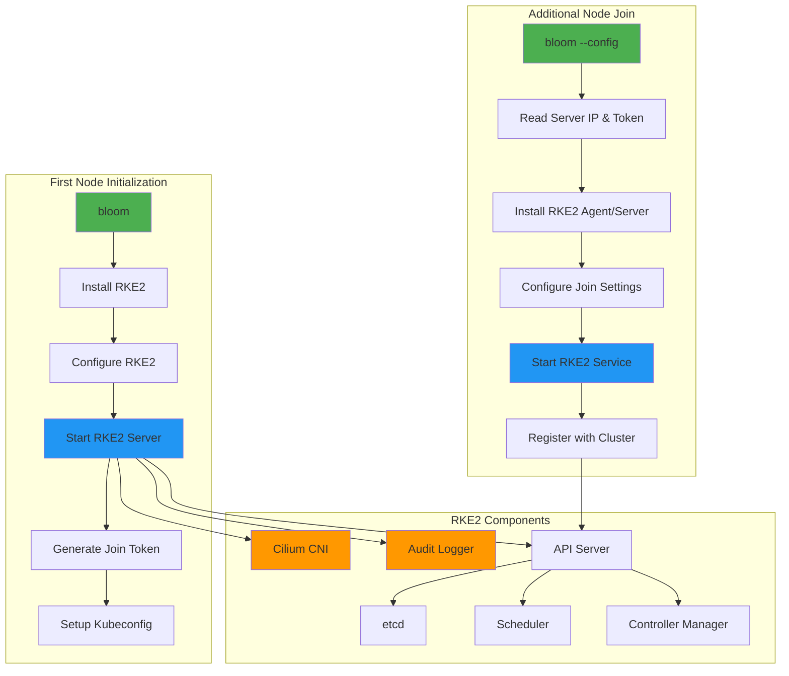

# Automated RKE2 Kubernetes Deployment

## Overview

ClusterBloom automates the deployment of RKE2-based Kubernetes clusters with specialized configurations for AMD GPU workloads and distributed storage systems.

## Components

### First Node Setup
Initializes the primary cluster node with all necessary configurations:
- RKE2 server installation and configuration
- Cluster initialization with custom parameters
- Token generation for additional nodes
- Kubeconfig setup for cluster access

**Configuration Files**:
- `/etc/rancher/rke2/config.yaml`: Main RKE2 configuration
- `/etc/rancher/rke2/audit/policy.yaml`: Kubernetes audit policy
- `/var/lib/rancher/rke2/server/node-token`: Join token for additional nodes

**Key Features**:
- Write kubeconfig with mode 0644 for easy access
- Give the cluster in the generated `~/.kube/config` the name of `DOMAIN`, thus clusters from different installations do not have the same name
- Disable default ingress controller (applications provide their own)
- Configure TLS SANs for secure API access
- Set up node labels for Longhorn storage integration
- OIDC authentication provider integration

### OIDC Authentication Integration
Automated OIDC provider configuration for Kubernetes API server authentication:
- **Default Provider**: Auto-configured `https://kc.{DOMAIN}/realms/airm` with audience `k8s`
- **Multiple Providers**: Support for additional OIDC providers via `ADDITIONAL_OIDC_PROVIDERS`
- **Audience Configuration**: Configurable client IDs per provider
- **RKE2 Integration**: Automatic kube-apiserver configuration on all control-plane nodes

**OIDC Configuration** (written to `/etc/rancher/rke2/config.yaml` on all control-plane nodes):
```yaml
# Generated automatically when DOMAIN is set
kube-apiserver-arg:
  - "--authentication-config=/etc/rancher/rke2/auth/auth-config.yaml"
```

**Authentication Flow**:
1. User obtains JWT token from configured OIDC provider
2. kubectl sends token with API requests via `Authorization: Bearer <token>`
3. kube-apiserver validates token against configured OIDC providers
4. User permissions determined by Kubernetes RBAC rules

### Additional Node Joining
Automated process for adding worker nodes or additional control plane nodes:
- Automatic RKE2 agent/server installation
- Secure token-based authentication
- Network configuration synchronization
- Service enablement and startup

**Worker Node Configuration**:
```yaml
server: https://\<FIRST_NODE_IP\>:9345
token: <JOIN_TOKEN>
```

**Control Plane Node Configuration**:
```yaml
server: https://\<FIRST_NODE_IP\>:9345
token: <JOIN_TOKEN>
write-kubeconfig-mode: "0644"
tls-san:
  - <NODE_IP>
```

### Cilium CNI Integration
Pre-configured with Cilium for advanced networking capabilities:
- **Network Policy Enforcement**: Fine-grained network security
- **VXLAN Overlay**: Port 8472/UDP for pod-to-pod communication
- **Health Checks**: Port 4240/TCP for health monitoring
- **Service Load Balancing**: eBPF-based load balancing
- **Network Visibility**: Optional Hubble for observability

For `CLUSTER_SIZE: small` or `medium`, bloom writes `/var/lib/rancher/rke2/server/manifests/rke2-cilium-config.yaml` on the **first node** before RKE2 starts, setting `operator.replicas: 1`. `CLUSTER_SIZE: large` uses the RKE2 chart default (2 replicas). Bloom does not auto-scale the operator when you add nodes later.

#### Scaling cilium-operator after install (multi-node / HA)

When a cluster that was deployed with `CLUSTER_SIZE: small` or `medium` grows beyond one node and you want the default HA operator count (2), run the following on the **bootstrap (first) node** after all nodes have joined:

```bash
# 1. Remove the single-replica HelmChartConfig bloom applied at install
sudo rm -f /var/lib/rancher/rke2/server/manifests/rke2-cilium-config.yaml

# 2. Remove the in-cluster HelmChartConfig (if present)
sudo kubectl --kubeconfig /etc/rancher/rke2/rke2.yaml \
  delete helmchartconfig rke2-cilium -n kube-system --ignore-not-found

# 3. Scale the operator deployment
sudo kubectl --kubeconfig /etc/rancher/rke2/rke2.yaml \
  -n kube-system scale deployment -l name=cilium-operator --replicas=2

# 4. Verify
sudo kubectl --kubeconfig /etc/rancher/rke2/rke2.yaml \
  -n kube-system get deployment -l name=cilium-operator
```

To stay at one operator replica on a single-node cluster, no action is required for small/medium installs.

#### Cilium readiness gating

A pod whose sandbox is created before the node's Cilium agent has programmed its
BPF datapath can end up with an endpoint that Cilium reports as `ready` but that
has no connectivity at all. This does not self-heal: `CrashLoopBackOff` recreates
the container inside the existing sandbox, never the sandbox, so the pod stays
wedged indefinitely. Bloom closes that window from both sides.

**Joining nodes** register with `node.cilium.io/agent-not-ready=true:NoExecute`
(written into `/etc/rancher/rke2/config.yaml` by `prepare_rke2.yaml`). The
rke2-cilium chart already sets `agent-not-ready-taint-key` and
`remove-cilium-node-taints=true`, so cilium-operator clears the taint once that
node's agent is healthy. Until then nothing that does not tolerate the taint is
scheduled on the node — notably the `longhorn-csi-plugin` DaemonSet pod, which
is created within a minute of a node joining an existing cluster and which bloom
never gets a chance to inspect. (Cilium's own agent tolerates everything, so it
still starts.) Bloom then blocks the join on the agent's own readiness endpoint
(`127.0.0.1:9879/healthz`, reachable from the host netns because the agent is
`hostNetwork`), so a node whose Cilium never comes up fails the run instead of
exiting 0 and looking `Ready`.

**Trap 1 — the first node is deliberately never tainted.** On a new cluster it is
the only node, and RKE2's `helm-install-rke2-cilium` Job does not tolerate
`node.cilium.io/agent-not-ready`. Tainting the first node would block the very
Cilium install that clears the taint: an unrecoverable bootstrap deadlock. The
first node is instead gated in ansible (`deploy_cluster/cluster_ready.yaml`),
which waits for the API server, this node's own Cilium agent healthz, and at
least one cilium-operator, before bloom creates any pod of its own. The gate is
deliberately node-local: `kubectl wait node --all` or a Cilium DaemonSet
`rollout status` would span the fleet, so one unrelated node that is drained or
powered off would fail every first-node run — including a `--tags
deploy_k8s_apps` rerun months later — for a reason unrelated to the request.

**Trap 2 — one Pending cilium-operator is normal on single-node `large`.**
`CLUSTER_SIZE: large` gets no `rke2-cilium-config.yaml`, so it runs the chart
default of 2 operator replicas with hard pod anti-affinity. During first-node
bloom there is exactly one node, so one replica is `Pending` by design. The gate
therefore checks for *at least one* Ready operator; writing it as
`kubectl wait --for=condition=Ready pod -l name=cilium-operator` or
`rollout status deploy/cilium-operator` would hang for the full timeout.

**Known limit:** kubelet applies registration taints only at a node's *first*
registration. A reboot recreates every sandbox on the node with no such
protection, and neither gate above re-runs on a reboot. Nodes joined before this
change was deployed are also unprotected. Treat the gates as closing the join
window, not as making the cluster immune.

#### CSI precondition before ClusterForge

Because nodes are normally joined with `CLUSTERFORGE_RELEASE: none` and
ClusterForge is deployed later, a node whose `longhorn-csi-plugin` never came up
stays latent — it looks `Ready` and nothing asks it for a volume — until that
deploy. The failure then surfaces as a `kubectl wait` timeout on an unrelated
workload, several layers above the cause.

`deploy_clusterforge` therefore checks up front that every node's CSINode lists
`driver.longhorn.io`, and fails naming the offending nodes. It runs only on
`CLUSTER_SIZE: large` without `NO_DISKS_FOR_CLUSTER`, since no other combination
deploys Longhorn, and retries for five minutes so a freshly joined node has time
to register.

If it fires, inspect the plugin on the named node:

```bash
kubectl -n longhorn get pods -o wide --field-selector spec.nodeName=<node>
```

A `CrashLoopBackOff` with `Failed to initialize Longhorn API client ... context
deadline exceeded` is the dead-sandbox case above. Restarting the container
cannot fix it — delete the pod so the DaemonSet builds a new sandbox:

```bash
kubectl -n longhorn delete pod <longhorn-csi-plugin-pod>
```

Note that a node you have tainted yourself will also fail this check: Longhorn's
DaemonSets ship no tolerations, so the CSI plugin never lands there.

**Cilium Features Enabled**:
- Native routing mode or VXLAN overlay (configurable)
- Kubernetes network policy support
- Service mesh capabilities (optional)
- Cluster-wide network connectivity

### Audit Logging
Built-in audit policy configuration for compliance and security monitoring:
- Metadata-level logging for all API requests
- Audit log rotation and retention
- Compliance with security standards (CIS, PCI-DSS)
- Integration with external log aggregation systems

**Audit Policy Configuration**:
```yaml
apiVersion: audit.k8s.io/v1
kind: Policy
rules:
  - level: Metadata
```

**Audit Log Location**: `/var/lib/rancher/rke2/server/logs/audit.log`

## Architecture


