# Storage Management with Longhorn

## Overview

ClusterBloom automates the deployment and configuration of Longhorn distributed storage system, providing persistent block storage for Kubernetes workloads.

## Components

### Disk Detection
Automatically identifies and selects available NVMe drives:
- **Detection Method**: Scans for NVMe block devices via /sys/block/
- **Filtering**: Excludes boot disks, mounted partitions, and swap devices
- **Virtual Disk Filtering**: Excludes QEMU, VMware virtual disks
- **Size Validation**: Ensures sufficient disk space for storage workloads

**Detection Process**:
```bash
# List NVMe devices
lsblk -d -o NAME,TYPE,SIZE | grep nvme

# Check mount status
mount | grep nvme

# Verify not swap
swapon --show
```

### Interactive Disk Selection
TUI interface for manual disk selection:
- **Visual Interface**: Terminal-based UI showing available disks
- **Disk Information**: Displays size, model, serial number
- **Multi-selection**: Select multiple disks for Longhorn storage pool
- **Confirmation**: Warns about data loss before formatting

**Selection Features**:
- Color-coded disk status (available, mounted, system)
- Keyboard navigation for disk selection
- Real-time disk information updates
- Safe abort option

### Automated Mounting
Formats and mounts selected drives with persistence:
- **Filesystem**: ext4 filesystem format
- **Mount Points**: `/mnt/disk0`, `/mnt/disk1`, etc.
- **fstab Entries**: UUID-based mounting for reliability
- **Mount Options**: `defaults,nofail` for robustness

**Mounting Process**:
1. Wipe existing filesystem signatures
2. Format disk with ext4
3. Get disk UUID
4. Create mount point directory
5. Add fstab entry with UUID
6. Mount disk

**fstab Entry Format**:
```
UUID=<disk-uuid> /mnt/disk0 ext4 defaults,nofail 0 2
```

### Longhorn Integration
Configures Longhorn distributed storage system:
- **Version**: v1.12.0
- **Data engine**: V2 by default (`LONGHORN_V2_DATA_ENGINE: true`); V1 filesystem disks when `false`
- **Storage Class**: `mlstorage` (`dataEngine: v2` by default)
- **Replica Count**: 1 in bundled `mlstorage` (configurable in manifest)
- **Data Locality**: best-effort

**Where the version lives in Cluster-Bloom**

Longhorn is pinned in static manifests, not selected via arbitrary version strings in `bloom.yaml`:

| Location | Role |
|----------|------|
| `pkg/ansible/runtime/manifests/longhorn/longhorn.yaml` | Full Longhorn v1.12.0 install (CRDs, Deployments, default settings including `v2-data-engine: true`) |
| `pkg/ansible/runtime/manifests/scripts/longhorn_preflight_check.sh` | Downloads matching `longhornctl` v1.12.0 |
| `pkg/ansible/runtime/playbooks/tasks/prepare_node/block_storage.yaml` | V2: `wipefs -a` on `CLUSTER_DISKS` (no mount/fstab) |
| `pkg/ansible/runtime/playbooks/tasks/prepare_node/storage.yaml` | V1: ext4 format + `/mnt/diskN` mount + fstab |
| `pkg/ansible/runtime/playbooks/tasks/prepare_node/longhorn_v2_prep.yaml` | V2: hugepages, kernel modules |

Set `LONGHORN_V2_DATA_ENGINE: false` to use V1 filesystem-type disks on the same Longhorn v1.12.0 bundle (manifest patched at deploy time).

**iSCSI target naming (V1 data engine only)**

When `LONGHORN_V2_DATA_ENGINE: false`, volumes use the v1 tgt + open-iscsi stack. Each volume target is named:

```
iqn.2019-10.io.longhorn:<volume-name>
```

Bloom's destructive cleanup (`pkg/ansible/runtime/cleanup.go`, constant `longhornIQNPrefix`) logs out only those sessions. OCI boot-volume iSCSI sessions are left untouched.

**Longhorn V2 data engine (default)**

V2 volumes use NVMe-TCP (not iSCSI). `CLUSTER_DISKS` devices are registered as raw block disks (`diskType: block`) via node labels and the node-annotator CronJob. Bloom runs `wipefs -a` before Longhorn claims the device; no ext4 mount or fstab entry is created.

V2 node prerequisites (configured by `longhorn_v2_prep.yaml`): 2 GiB of 2 MiB hugepages, `vfio_pci`, `uio_pci_generic`, and `nvme_tcp` modules.

See [Longhorn V2 Data Engine Evaluation](longhorn-v2-data-engine-evaluation.md) for design rationale and cleanup behaviour.

**Longhorn Features**:
- **Distributed Storage**: Replicated block storage across nodes
- **Snapshots**: Volume snapshots for backup and recovery
- **Backups**: S3/NFS backup support
- **CSI Driver**: Container Storage Interface compliance
- **Volume Encryption**: Optional volume encryption
- **Volume Cloning**: Clone volumes for testing

**Longhorn Configuration**:
```yaml
apiVersion: v1
kind: ConfigMap
metadata:
  name: longhorn-default-setting
  namespace: longhorn-system
data:
  create-default-disk-labeled-nodes: "true"
  default-data-path: "/mnt/disk0"
  replica-soft-anti-affinity: "true"
  disable-revision-counter: "true"
  priority-class: "longhorn-critical"
```

### Storage Class Configuration
Default storage class for PVC provisioning:
```yaml
apiVersion: storage.k8s.io/v1
kind: StorageClass
metadata:
  name: mlstorage
  annotations:
    storageclass.kubernetes.io/is-default-class: "true"
provisioner: driver.longhorn.io
allowVolumeExpansion: true
reclaimPolicy: Delete
volumeBindingMode: Immediate
parameters:
  numberOfReplicas: "3"
  staleReplicaTimeout: "2880"
  fromBackup: ""
  fsType: "ext4"
```

## Cleanup Behaviour

Bloom provides two equivalent paths to clean up storage before redeployment:

### `bloom cleanup [config-file]`

Standalone cleanup command. Accepts an optional config file to read `CLUSTER_DISKS` and `CLUSTER_PREMOUNTED_DISKS`:

```bash
sudo ./bloom cleanup bloom.yaml
```

**Sequence:**
1. **Longhorn API cleanup** (when cluster reachable) — sets `deleting-confirmation-flag` and runs the upstream `longhorn-uninstall` job
2. **Best-effort node drain** (if cluster reachable, ~30s timeout)
   - Internally passes `--force` and `--disable-eviction` to kubectl drain to bypass stuck pods with finalizers or PodDisruptionBudgets
   - Automatically skips Longhorn volume detach wait when no volumes detected
   - Clear progress messages during potentially long operations
2. Logout **Longhorn-only** iSCSI sessions (filter `iqn.2019-10.io.longhorn:*`, logout by session ID; boot-volume sessions are preserved) → stop Longhorn processes
3. Force-unmount all Longhorn/CSI/kubelet volumes (including `volume-subpaths` and `globalmount`)
4. Uninstall RKE2 and remove its directories
5. **Pre-clean future mount range** — removes bloom artifacts (`pvc-*`, `replicas`, `longhorn-disk.cfg`) from the directories that will be used in the next deployment, preserving user files
6. **Clean premounted disks** (`CLUSTER_PREMOUNTED_DISKS`) — removes bloom artifacts only; filesystem, fstab entry, and user files are preserved
7. **Remove bloom-managed fstab entries** and wipe `CLUSTER_DISKS` device signatures

**Block devices are never removed from the kernel.** Cleanup wipes and reformats `CLUSTER_DISKS` and `RANCHER_DISK` (`wipefs -a` + `mkfs.ext4 -F`), but leaves the devices attached, so they remain visible in `lsblk` and can be reused directly by the next deployment.

### `bloom cli bloom.yaml --destroy-data`

Equivalent to running `bloom cleanup` then redeploying. Cleanup tasks are prepended to the Ansible playbook. Both paths call the same logic and produce the same end state.

### Disk Wipe Preview

Before requiring confirmation, both paths display a preview table:

```
──────────────────────────────────────────────────────────────
  ⚠️   DISK CLEANUP PREVIEW
──────────────────────────────────────────────────────────────
  Bloom-managed mounts to be WIPED:
    ✓  /mnt/disk11       — bloom state only (3 item(s))
    ⚠️  /mnt/disk12       — 2 bloom item(s), ⚠️  1 user file(s) will be LOST: myfile.txt
    ⚠️  /mnt/disk13       — 5 bloom item(s), ⚠️  8 user file(s) will be LOST

  Future mount range (/mnt/disk1 – /mnt/disk6): bloom artifacts pre-cleaned, user files preserved
    ✓  /mnt/disk1        — empty
    ℹ️  /mnt/disk6        — 1 bloom artifact(s) removed; 1 user file(s) kept: test
──────────────────────────────────────────────────────────────
```

**Preview Features:**
- User files listed individually (up to 5), or count shown if more than 5
- `lost+found` folders automatically excluded (ext4 system folder, not user data)
- Clear visual distinction: ✓ (safe), ⚠️ (caution), ℹ️ (info)
- Separate sections for wiped mounts vs. pre-cleaned future range

### Mount Index Allocation

`CLUSTER_DISKS` and `CLUSTER_PREMOUNTED_DISKS` can now be used simultaneously. The mount index for `CLUSTER_DISKS` is chosen as the **lowest contiguous range starting from 0** that does not conflict with indexes reserved by:

- `CLUSTER_PREMOUNTED_DISKS` paths (e.g. `/mnt/disk0` → reserves index 0)
- `/etc/fstab` entries tagged `# premounted by cluster-bloom`

**Example**: with `CLUSTER_PREMOUNTED_DISKS: /mnt/disk0` and 6 CLUSTER_DISKS, the range `/mnt/disk1`–`/mnt/disk6` is chosen (index 0 is reserved). If a prior deployment used `/mnt/disk11`–`/mnt/disk16` those fstab entries are removed by cleanup before the new index is calculated.

### RANCHER_DISK Configuration

The `RANCHER_DISK` parameter allows operators to specify a dedicated device for `/var/lib/rancher` storage, primarily designed for GPU worker nodes with intensive workloads that benefit from dedicated fast storage for kubelet and container runtime data.

**Key Features**:
- **Dedicated Storage**: Provides dedicated fast storage for `/var/lib/rancher` directory
- **Direct Mount**: Device is formatted and mounted directly at `/var/lib/rancher`
- **Automatic Setup**: Bloom handles device formatting, mounting, and fstab configuration
- **Clean Deployment**: Removes existing `/var/lib/rancher` for fresh cluster setup

**Configuration**:
```yaml
RANCHER_DISK: /dev/nvme2n1
```

**Requirements**:
1. Device path must start with `/dev/` (e.g., `/dev/nvme2n1`, `/dev/sdb2`)
2. Device must exist and not be already mounted
3. Minimum 100GB available space (500GB recommended)
4. Cannot be used with `NO_DISKS_FOR_CLUSTER: true`

**Implementation Details**:
- Formats device with ext4 filesystem
- Mounts directly at `/var/lib/rancher`
- Adds fstab entry: `UUID=<device-uuid> /var/lib/rancher ext4 defaults,nofail 0 2`
- Tagged as: `# managed by cluster-bloom rancher-disk`

**Node Type Recommendations**:

#### GPU Worker Nodes (Primary Use Case)
- **Heavy GPU Workloads**: Highly recommended for nodes running intensive GPU applications
- **Large Container Images**: Benefits from dedicated fast storage for image pulls and caching
- **Extensive Logging**: GPU workloads often generate large logs that benefit from dedicated storage
- **High Container Churn**: Nodes with frequent container creation/deletion benefit from dedicated kubelet storage

#### Control Plane Nodes (Optional)
- **First Node** (`FIRST_NODE: true`): Can use RANCHER_DISK for dedicated RKE2 bootstrap and etcd storage
- **Additional Control Plane** (`FIRST_NODE: false, CONTROL_PLANE: true`): Can use RANCHER_DISK for etcd replicas and server components  
- **Large Clusters**: May improve HA performance with 3+ control plane nodes

#### CPU Worker Nodes (Optional)
- **High I/O Workloads**: Consider RANCHER_DISK for nodes with high container runtime activity
- **Standard Workloads**: Default `/var/lib/rancher` location usually sufficient

**Setup and Cleanup Behavior**:
- **Setup**: Removes existing `/var/lib/rancher` directory for clean deployment and mounts dedicated device
- **Cleanup**: Unmounts `/var/lib/rancher` and removes fstab entry
- **Fresh Start**: Creates clean `/var/lib/rancher` directory after cleanup
- **Device Preservation**: Underlying device is preserved (no reformatting during cleanup)

## Architecture

```mermaid
flowchart TD
    %% Environment Variables
    subgraph Variables[" Environment Variables (Configuration) "]
        V1[NO_DISKS_FOR_CLUSTER: Skip all disk operations<br/>Default: false]
        V2[CLUSTER_DISKS: Pre-configured disk list<br/>e.g., '/dev/sdb,/dev/sdc'<br/>Default: empty]
        V3[CLUSTER_PREMOUNTED_DISKS: Override Longhorn config<br/>e.g., '/mnt/disk0,/mnt/disk1'<br/>Default: empty]
    end
    
    %% Legend
    subgraph Legend[" Legend "]
        L1[🟨 Variable Check Points - affect flow direction]
        L2[🟩 Start/End Points]
        L3[🟦 Configuration Write]
        L4[⬜ Process Steps]
    end
    
    Start([Start Disk Setup]) --> Variables
    Variables --> CheckSkip{NO_DISKS_FOR_CLUSTER?}
    
    CheckSkip -->|Yes = true| End([End - Skipped])
    CheckSkip -->|No = false| CheckSelected{CLUSTER_DISKS<br/>configured?}
    
    CheckSelected -->|Yes - has value| UseSelected[Use configured disks<br/>from CLUSTER_DISKS variable]
    CheckSelected -->|No - empty| GetUnmounted[GetUnmountedPhysicalDisks]
    
    GetUnmounted --> ListDisks[lsblk -dn -o NAME,TYPE]
    ListDisks --> FilterDisks{Filter disks}
    
    FilterDisks --> CheckDiskType{Disk type?}
    CheckDiskType -->|nvme*| AddToList1[Add to disk list]
    CheckDiskType -->|sd*| CheckVirtual{Is virtual disk?}
    CheckDiskType -->|Other| SkipDisk[Skip disk]
    
    CheckVirtual -->|Yes| SkipDisk
    CheckVirtual -->|No| AddToList2[Add to disk list]
    
    AddToList1 --> CheckMounted{Is mounted?}
    AddToList2 --> CheckMounted
    
    CheckMounted -->|Yes| SkipDisk
    CheckMounted -->|No| AddAvailable[Add to available disks]
    
    SkipDisk --> NextDisk{More disks?}
    AddAvailable --> NextDisk
    
    NextDisk -->|Yes| FilterDisks
    NextDisk -->|No| ShowSelection[Show disk selection UI]
    
    UseSelected --> MountDrives
    ShowSelection --> StoreSel[Store selected_disks<br/>in viper config]
    StoreSel --> MountDrives[MountDrives function]
    
    MountDrives --> CheckLonghorn{CLUSTER_PREMOUNTED_DISKS<br/>configured?}
    CheckLonghorn -->|Yes - has value| SkipMount[Skip mounting<br/>Use CLUSTER_PREMOUNTED_DISKS paths]
    CheckLonghorn -->|No - empty| ProcessEachDisk[Process each disk]
    
    ProcessEachDisk --> CheckFormat{Disk has ext4?}
    CheckFormat -->|Yes| CheckFstab{In /etc/fstab?}
    CheckFormat -->|No| WipePartitions[Wipe partitions if exist]
    
    WipePartitions --> FormatExt4[mkfs.ext4 -F -F]
    FormatExt4 --> CheckFstab
    
    CheckFstab -->|Yes| AutoMount[mount -a]
    CheckFstab -->|No| FindMountPoint[Find next available<br/>/mnt/diskX]
    
    AutoMount --> NextMountDisk{More disks?}
    FindMountPoint --> CreateDir[mkdir -p /mnt/diskX]
    CreateDir --> MountDisk[mount disk /mnt/diskX]
    MountDisk --> NextMountDisk
    
    NextMountDisk -->|Yes| ProcessEachDisk
    NextMountDisk -->|No| PersistMounts[PersistMountedDisks]
    
    PersistMounts --> GetUUID[Get UUID for each<br/>mounted disk]
    GetUUID --> UpdateFstab[Add to /etc/fstab:<br/>UUID=xxx /mnt/diskX ext4 defaults,nofail 0 2]
    UpdateFstab --> RemountAll[mount -a]
    
    RemountAll --> GenerateNodeLabels[GenerateNodeLabels]
    SkipMount --> GenerateNodeLabels
    
    GenerateNodeLabels --> CheckLonghornConfig{CLUSTER_PREMOUNTED_DISKS<br/>configured?}
    CheckLonghornConfig -->|Yes - has value| ParseConfig[Parse CLUSTER_PREMOUNTED_DISKS<br/>comma-separated list]
    CheckLonghornConfig -->|No - empty| FindMounted[Find mounted disks<br/>at /mnt/diskX]
    
    ParseConfig --> CreateLabelString[Join with 'xxx'<br/>delimiter]
    FindMounted --> UseAllMounted[Use all mounted disks]
    
    UseAllMounted --> CreateLabelString
    
    CreateLabelString --> WriteRKE2Config[Append to /etc/rancher/rke2/config.yaml:<br/>node-label:<br/>  - node.longhorn.io/create-default-disk=config<br/>  - node.longhorn.io/instance-manager=true<br/>  - silogen.ai/longhorndisks=disk0xxxdisk1xxx...]
    
    WriteRKE2Config --> End
    
    style Start fill:#32CD32,stroke:#006400,stroke-width:3px
    style End fill:#FF69B4,stroke:#C71585,stroke-width:3px
    style Variables fill:#D8BFD8,stroke:#8B008B,stroke-width:2px
    style CheckSkip fill:#FFD700,stroke:#FF4500,stroke-width:4px,color:#000000
    style CheckSelected fill:#FFD700,stroke:#FF4500,stroke-width:4px,color:#000000
    style CheckLonghorn fill:#FFD700,stroke:#FF4500,stroke-width:4px,color:#000000
    style CheckLonghornConfig fill:#FFD700,stroke:#FF4500,stroke-width:4px,color:#000000
    style WriteRKE2Config fill:#4682B4,stroke:#00008B,stroke-width:3px
```


